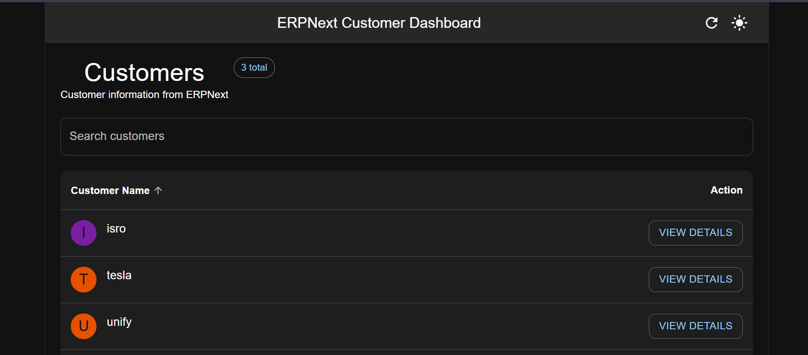
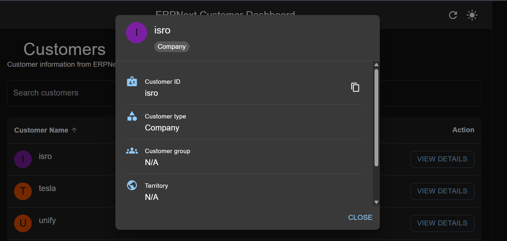
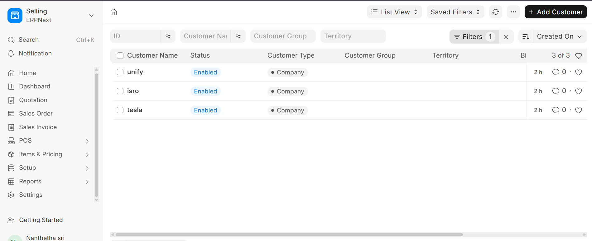
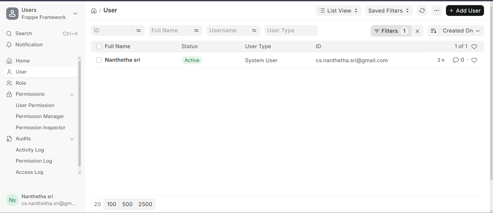

# ERPNext Customer Dashboard

A React.js dashboard that connects to an ERPNext instance through its REST API and lets users browse, search and view customers.

## Features

- Token-based authentication with ERPNext (API key and secret)
- Customer list shown in a table with sorting and pagination
- Live search by customer name
- Customer details in a modal (ID, type, group, territory, tax ID)
- Responsive Material-UI interface with light and dark themes
- Loading skeletons, error messages with retry, and empty states

## Tech Stack

- **Frontend:** React (Vite), Material-UI (MUI)
- **Backend:** Node.js, Express
- **Data source:** ERPNext / Frappe REST API

## Prerequisites

- Node.js 18 or later (the backend uses the built-in `fetch`)
- A running ERPNext instance (local install or ERPNext cloud)
- An API key and secret for an ERPNext user

## Getting an API key and secret

1. Log in to ERPNext and open **User** > your user.
2. Open the **API Access** section and click **Generate Keys**.
3. Copy the API key and the API secret (the secret is shown only once).

## Setup

### 1. Backend

```bash
cd backend
npm install
cp .env.example .env
```

Edit `.env` with your values:

```
FRAPPE_URL=http://localhost:8080
FRAPPE_API_KEY=your_api_key
FRAPPE_API_SECRET=your_api_secret
```

Start the server:

```bash
node server.js
```

It runs on `http://localhost:5000`. To confirm authentication works, open `http://localhost:5000/api/test-auth`. It should return the ERPNext user.

### 2. Frontend

```bash
cd frontend
npm install
npm install @mui/icons-material
npm run dev
```

Open `http://localhost:5173`.

## API Endpoints (backend)

| Method | Endpoint | Description |
|---|---|---|
| GET | `/api/test-auth` | Checks that the ERPNext credentials are valid |
| GET | `/api/customers` | Lists customers (up to 100) |
| GET | `/api/customers/:name` | Returns details for one customer |

## Project Structure

```
.
├── backend/
│   ├── server.js          # Express proxy to the ERPNext API
│   ├── .env.example       # Environment variable template
│   └── package.json
└── frontend/
    ├── src/
    │   ├── App.jsx        # Dashboard UI: table, search, details modal, theme
    │   └── main.jsx
    └── package.json
```

## How It Works

1. The React app calls the Express backend, never ERPNext directly.
2. The backend adds the `Authorization: token key:secret` header and forwards the request to ERPNext.
3. The response is returned to React, which renders the table and the details modal.

## Assumptions

- Authentication uses ERPNext API key and secret (token authentication), kept on the server in `.env` so it is never exposed in the browser.
- The customer list is limited to 100 records, which is enough for a demo. Pagination on the frontend handles display.
- Search is done on the frontend, on the list already loaded.
- The backend and frontend run locally on ports 5000 and 5173.

## Screenshots

### Customer Dashboard



### Detailed view 


### ERPNext Customer List



### ERPNext User / API Setup



